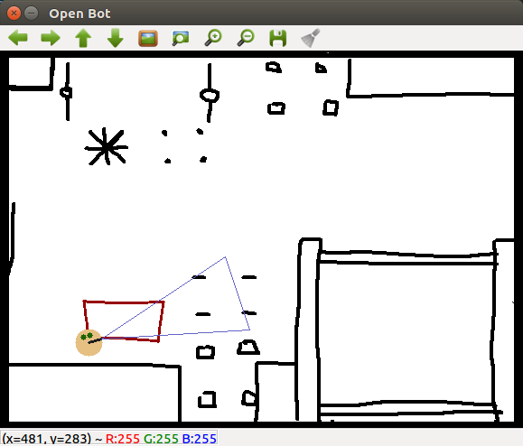

# Assignment 3: Steering a robot

When you have completed assignment 2 you are ready for assignment 3.

By now you should have learned a few basics of python and how to write a callback in this robot framework.

## It's all about motion...

In this assignment the robot should start moving. The goal is to get the robot to drive a rectangle with a size of 20 cm by 30 cm.

Whereas in robotics it is usually about having a little help with the api but solving the problem alone.
This task description will only tell you how to set the speed and turn of a robot and you have to figure out the rest by yourself.
But don't think to complicated. You MUST NOT use any robot api that has not yet been introduced.

```python
from robots.alice import Robot, MAX_SPEED

robot = Robot()
robot.set_speed(MAX_SPEED)  # move with full speed
robot.set_turn(0.5)  # turn left with 50%

robot.wait()
robot.shutdown()

```



## Bonus

Make the shape of the rectangle configurable by introducing two variables WIDTH = 0.2 and HEIGHT = 0.3.

## Hint
Your turning won't be perfect just yet, try and get it as close as possible.

## Reminder: Using a real robot

If you want to use a real robot and not the simulator you have to provide a host to the robot constructor.
Here are the examples for alice and eve:

```python
# Alice
robot = Robot(host="alice-bot.local")

# Eve
robot = Robot(host="eve-bot.local")
```
