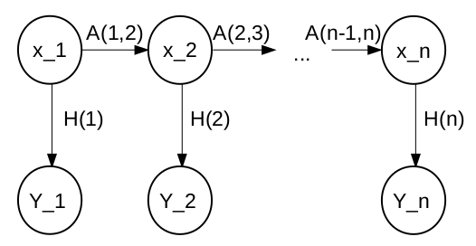

# Bonus Assignment: Graph SLAM

WARNING: This task is quite difficult and requires you to read some scripts about the topic.
The task description will provide you very little help to solving it.
However, links to sources that will help you understanding your task will be provided.

Since the goal of the task is to become a master of SLAM, it will take some time to complete.
You will also have to find and read your own literature on everything, that is not explained in detail here.

Required knowledge:
* Basics of Linear Algebra
* Statistics (conditional probability, bayes rule, covariance matrix)
* Basics in Robotics

## Steps to Graph SLAM

### Markov Chains

The first concept you will have to understand is the concept of a markov chain.
Basically the motion of our robot is a markov chain.

The robot is at a position <a href="https://www.codecogs.com/eqnedit.php?latex=x_k" target="_blank"></a> at the time k.
Then a system model A moves the robot to the next position. <a href="https://www.codecogs.com/eqnedit.php?latex=x_k" target="_blank"></a>.

However, we cannot directly observe <a href="https://www.codecogs.com/eqnedit.php?latex=x_k" target="_blank"></a> so we have to guess it from measurements <a href="https://www.codecogs.com/eqnedit.php?latex=x_k" target="_blank"></a>
The measurements are generated by the model by a measurement function called H.

A markov model thereby is first applying A to <a href="https://www.codecogs.com/eqnedit.php?latex=x_k" target="_blank"></a> and receiving <a href="https://www.codecogs.com/eqnedit.php?latex=x_k" target="_blank"></a> and then applying H on <a href="https://www.codecogs.com/eqnedit.php?latex=x_k" target="_blank"></a> to obtain <a href="https://www.codecogs.com/eqnedit.php?latex=x_k" target="_blank"></a>.




In Localisation we basically want to estimate the state x of the system by only observing the measurements Y and knowing A and H.

### Utility Library `slamlib`

You can use `slamlib`, to help you with some of the basics, such as correctly handling poses and handling a dataset (even ros bindings).
Keep your code compatible with `slamlib` and use it where ever possible.

https://github.com/penguinmenac3/slam-notebooks/tree/master/slamlib

### Localisation Basics (Kalman Filter)

With those basics in mind, read the following introduction to localisation.

https://github.com/penguinmenac3/slam-notebooks/blob/master/Localisation%20Basics.ipynb

Try to implement a kalman filter that guesses the current pose of the robot using local_position as prediction and global_position as measurement.

Furthermore, you can write an extended kalman filter using the distance sensors. However, the latter is quite difficult.

### Collecting a Dataset

As you may noticed it is annoying to always run the robot again, when you changed the code.
Furthermore, you cannot check if you improved your algorithm if you feed it different data each time.

So your next task is to collect a slam dataset.

Collect it in a way so that it is compatible with the format in the slamlib.
This will give you the ability to use it for replay.

https://github.com/penguinmenac3/slam-notebooks/blob/master/Handling%20a%20Dataset.ipynb


### Plot a Map

Read the instructions on how to create a density grid map.

https://github.com/penguinmenac3/slam-notebooks/blob/master/Mapping.ipynb

Implement your own density grid map here.

### Advanced Localisation using Graph SLAM

Next stop will be to implement a graph slam.

#### Pose Graph

A pose graph basically models the markov chain by modeling poses as nodes in the graph and constraints in between those poses as edges.
The edges are basically the systemmodel of the markov chain and the poses the hidden state which we want to estimate.
Comparable to a markov chain there are often multiple solutions to a pose graph as long it has no global constraints.

An example of a pose graph (well the markov chain from above was a pose graph):


#### Implementation Help

Your task will be to use the ros graph slams pmsmooth library to globally localise the robot.
For localisation you will have to construct a Pose Graph and solve it using pmsmooth.

You can find pmsmooth in the ros_graph_slam repository.
Of course the repository contains a ros interface for graph slam, which can be used with ros.
However, we are not using the simple ros interface but try to understand how it works.
To use pmsmooth separately you have to clone https://github.com/penguinmenac3/ros_graph_slam.git and checkout pmsmooth branch.

Ideally you clone this into the assignment_bonus_graph_slam folder.

```bash
cd .../ros_graph_slam
git checkout pmsmooth
```

After you have checked out the repo you can navigate to `ros_graph_slam/scripts/slambackends/pmsmooth` and try to understand the methods.
